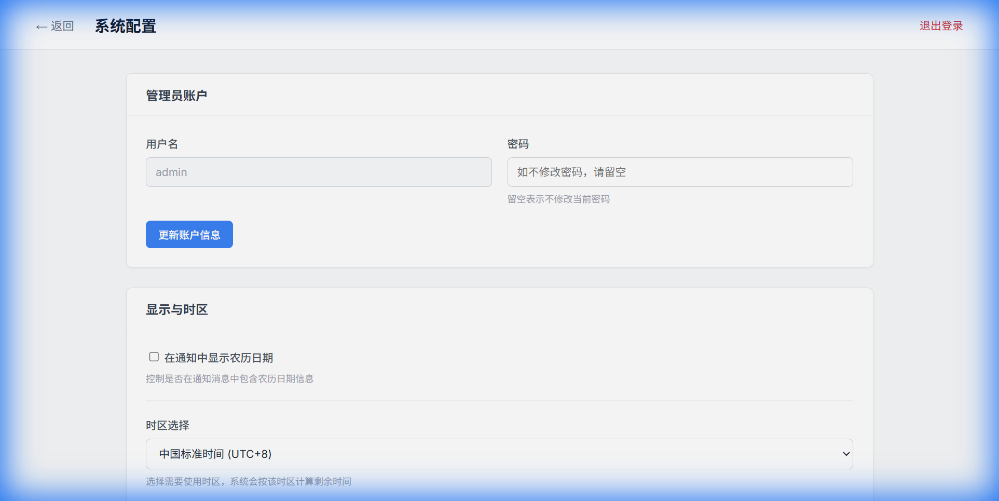
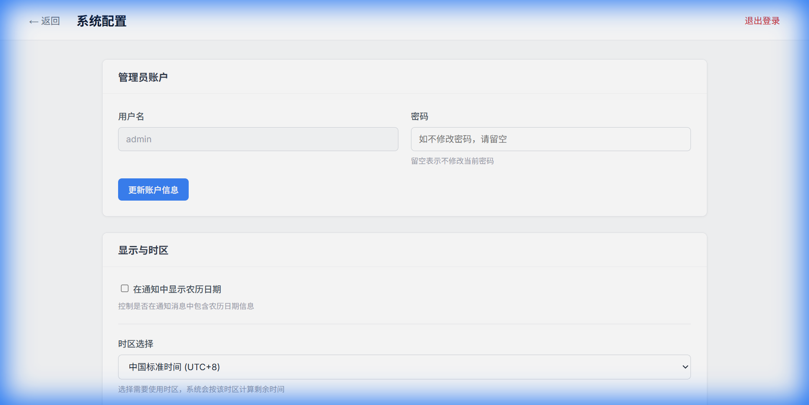

# 老王订阅管理系统

<p align="center">
  
  
  
  
  <br/>
  <a href="https://github.com/tony-wang1990/laowang-subscription/issues">🐛 提交问题</a>
</p>

> **高颜值的私有化订阅管理系统。集中管理您的 VPS、域名、SSL 证书及各类会员服务，支持 Telegram、微信、邮件等多渠道到期自动提醒，防止服务意外中断。**

---

## ✨ 功能特性

- **🎨 现代化界面**: 精心设计的 UI，支持 **深色模式**、**浅色模式** 及 **跟随系统**
- **🔔 多渠道通知**: 内置 **Telegram**、**微信 (Server酱/企业微信)**、**邮件**、**Bark** 及自定义 **Webhook**
- **📅 灵活订阅周期**: 支持按天、月、年设置，甚至支持永久订阅或一次性订阅
- **📊 仪表盘概览**: 直观的操作界面，支持搜索、筛选、分类管理
- **🔐 私有化安全**: 数据存储在本地 SQLite 数据库，无需担心隐私泄露
- **☁️ 天气与农历**: 贴心的内置天气显示与农历日期支持

---

## 📸 界面预览

### 仪表盘
| 浅色模式 | 深色模式 |
| :---: | :---: |
|  |  |

### 设置页面
| 通用设置 | 通知配置 |
| :---: | :---: |
|  |  |

---

## 🚀 一键部署

### 方式一：Railway（推荐 ⭐）

免费额度每月 $5，无需信用卡即可开始。

[](https://railway.app/template/laowang-subscription?referralCode=tony)

**或手动部署：**
1. 登录 [Railway](https://railway.app)
2. 点击 "New Project" → "Deploy from GitHub repo"
3. 选择 `laowang-subscription` 仓库
4. 等待部署完成，点击生成的域名访问

---

### 方式二：Render

免费套餐可用，部署简单。

[](https://render.com/deploy?repo=https://github.com/tony-wang1990/laowang-subscription)

---

### 方式三：Fly.io

全球边缘部署，速度快。

```bash
# 安装 flyctl
curl -L https://fly.io/install.sh | sh

# 登录
flyctl auth login

# 克隆并部署
git clone https://github.com/tony-wang1990/laowang-subscription.git
cd laowang-subscription
flyctl launch
flyctl deploy
```

---

### 方式四：Docker Compose（VPS）

适用于有 Docker 环境的 VPS。

```bash
# 克隆仓库
git clone https://github.com/tony-wang1990/laowang-subscription.git
cd laowang-subscription

# 一键启动
docker-compose up -d
```

启动后访问 `http://your-ip:3000` 即可使用。

---

### 方式五：Zeabur（推荐中国用户 ⭐）

支持中文界面，国内访问速度快，部署简单。

**部署步骤：**
1. 登录 [Zeabur](https://zeabur.com)
2. 点击 "Create Project" → "Deploy from GitHub"
3. 授权并选择 `laowang-subscription` 仓库
4. Zeabur 会自动识别项目配置并开始部署
5. 等待部署完成，点击生成的域名访问

> 💡 **提示**: 项目已包含 `zeabur.json` 配置文件，Zeabur 会自动使用正确的构建和启动命令。

---

### 方式六：手动部署 (Node.js)

适用于 Linux VPS（需安装 Node.js 20+）。

```bash
git clone https://github.com/tony-wang1990/laowang-subscription.git
cd laowang-subscription

npm install
npm run build
npm start
```

---

## 🛠️ 本地开发

```bash
git clone https://github.com/tony-wang1990/laowang-subscription.git
cd laowang-subscription
npm install
npm run dev
```

---

## 📝 常见问题

### 默认账号密码是什么？

默认管理员账号：`admin`，密码：`admin`  
首次登录后请立即在"设置"页面修改密码。

### 如何添加 HTTPS？

- **Railway/Render/Fly.io**: 自动配置 SSL
- **自建 VPS**: 推荐使用 Nginx + Let's Encrypt 反向代理

### 数据存储在哪里？

数据存储在 SQLite 数据库文件中（`database/subscription.db`）。  
建议定期备份此文件。

---

## 🤝 贡献与支持

欢迎提交 Pull Request 或 Issue！

## 📄 开源协议

MIT License
