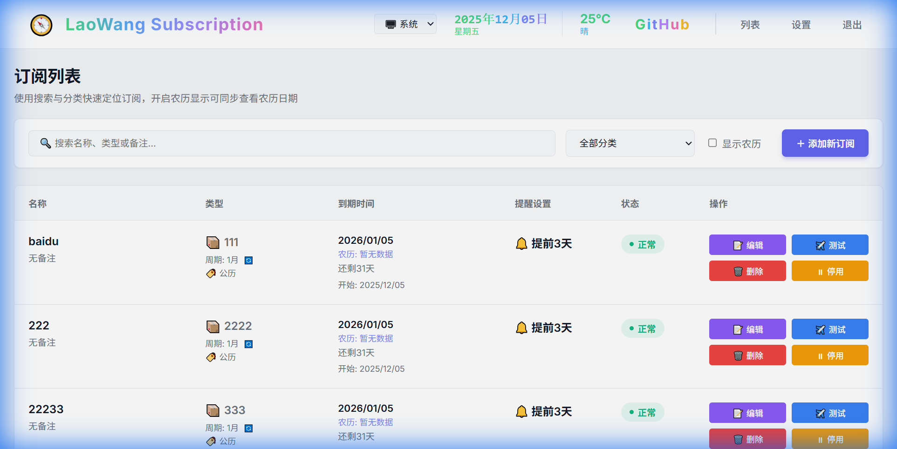
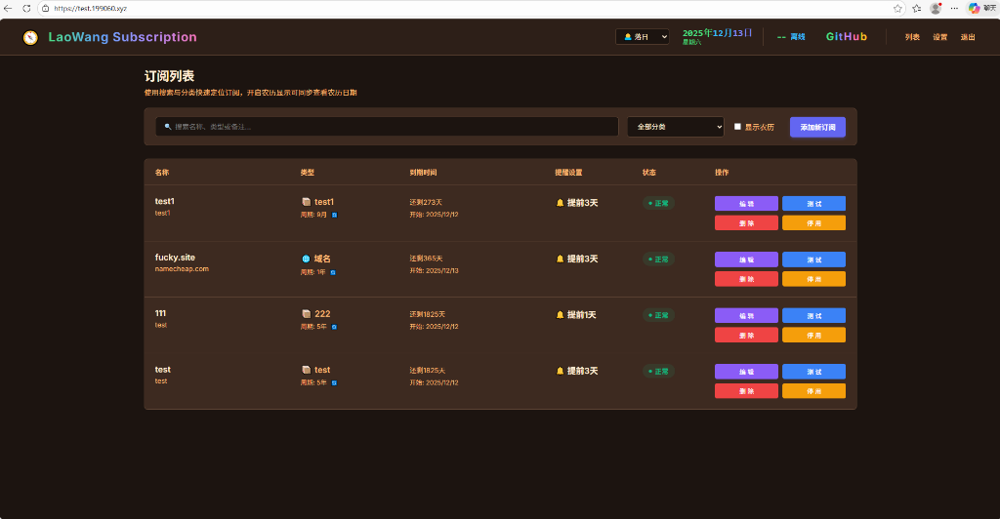

# 老王订阅管理系统 (LaoWang Subscription)

这是一个基于 Vue 3 + Express 的一站式订阅管理系统，集成了 [SubConverter](https://github.com/tindy2013/subconverter) 订阅转换功能。它不仅仅是一个前端，更是一个完整的订阅管理解决方案。

<p align="center">
  <a href="https://test.199060.xyz/" target="_blank">
    
  </a>
</p>


## 📸 界面预览

### 桌面端预览

| 浅色模式 | 深色模式 |
| :---: | :---: |
|  |  |


## ✨ 特性

-   🎨 **现代化 UI**: 采用 Tailwind CSS 构建，支持深色/浅色模式自动切换。
-   📱 **响应式设计**: 完美适配桌面端和移动端。
-   🌍 **多语言支持**: 内置英语和简体中文，根据浏览器语言自动切换。
-   🛠️ **强大配置**: 支持 SubConverter 所有主流配置项（远程配置、后端地址、包含/排除节点、文件名等）。
-   ⚡ **实时预览**: 配置更改变动即时反映在生成的链接中。
-   🔗 **短链接集成**: 完美支持 MyUrls 等短链接服务。
-   🐳 **Docker 部署**: 提供多架构 (AMD64/ARM64) 镜像，一键部署。

## 🚀 部署指南 (VPS)

本项目推荐使用 Docker 在 VPS 上进行部署。支持甲骨文 ARM (Oracle ARM) 及常规 AMD64 服务器。

### 前置要求

-   一台拥有公网 IP 的 Linux 服务器 (VPS)
-   已安装 [Docker](https://docs.docker.com/get-docker/) 和 [Docker Compose](https://docs.docker.com/compose/install/)

### 方式一：Docker Run (最简方式)

直接运行以下命令即可启动服务：

```bash
docker run -d \
  --name laowang-subscription \
  -p 8080:8080 \
  --restart always \
  -v ./database:/app/database \
  ghcr.io/tony-wang1990/laowang-subscription:main
```

-   启动后，访问 `http://IP:8080` 即可。
-   数据文件会保存在当前目录下的 `database` 文件夹中。

### 方式二：Docker Compose (推荐)

在服务器上创建一个 `docker-compose.yml` 文件：

```yaml
version: '3'

services:
  app:
    image: ghcr.io/tony-wang1990/laowang-subscription:main
    container_name: laowang-subscription
    restart: always
    ports:
      - "8080:8080"
    volumes:
      - ./database:/app/database
    environment:
      - TZ=Asia/Shanghai
```

然后运行：

```bash
docker-compose up -d
```

### 🔄 如何更新

当项目均有更新（发布新镜像）时，在 VPS 上执行以下命令即可无损升级：

#### Docker Compose (推荐)

```bash
# 1. 拉取最新镜像
docker-compose pull

# 2.重新创建容器 (不会删除数据)
docker-compose up -d --force-recreate

# 3. 清理旧镜像 (可选)
docker image prune -f
```

#### Docker Run

```bash
# 1. 停止并删除容器
docker stop laowang-subscription
docker rm laowang-subscription

# 2. 拉取最新镜像
docker pull ghcr.io/tony-wang1990/laowang-subscription:main

# 3. 重新运行命令 (把之前的 docker run 命令再跑一遍)
docker run -d ...
```

### 方式三：手动构建

如果您想自己构建镜像：

```bash
git clone https://github.com/tony-wang1990/laowang-subscription.git
cd laowang-subscription
docker build -t laowang-subscription .
docker run -d -p 8080:8080 laowang-subscription
```

## 🛠️ 环境变量

| 变量名 | 默认值 | 描述 |
| :--- | :--- | :--- |
| `PORT` | 8080 | 服务监听端口 |
| `JWT_SECRET` | 随机生成 | 用于 session 加密的密钥 (可选) |
| `WEB_PORT` | - | 用于 Web 界面显示的端口 (通常无需设置) |

## 📦 架构说明

-   **Frontend**: Vue 3, Vite, Tailwind CSS
-   **Backend**: Node.js, Express, SQLite (better-sqlite3 / sqlite3)
-   **Database**: SQLite (存储订阅历史和设置)

## 🤝 贡献

欢迎提交 Issue 和 Pull Request！

## 📄 许可证

MIT License
