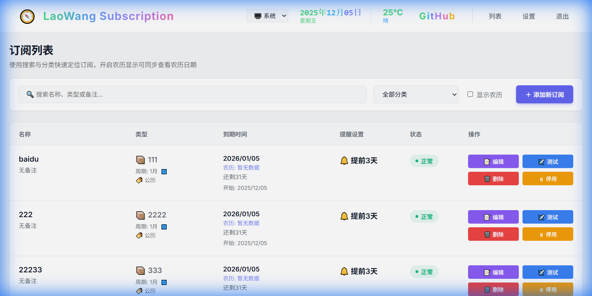
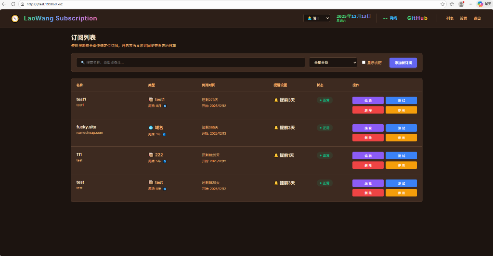

# 🐻 老王订阅管理系统 (LaoWang Subscription)

> **专为个人打造的订阅费用与到期管理神器**
>
> 告别 Excel，用最优雅的方式管理你的 Netflix、Spotify、域名、服务器VPS等周期性支出。只有真正的后端服务，才能提供真正的到期推送提醒！

[](https://github.com/tony-wang1990/laowang-subscription)
[](https://hub.docker.com/)
[](LICENSE)

## ✨ 核心亮点

### 🎨 极致的视觉体验

- **双视图切换**：[≡ 列表模式] 高效扫视 / [⊞ 卡片模式] 沉浸浏览。
- **📅 日历视图 (v1.5)**：月历形式直观展示每一天的付款计划。
- **PWA 支持**：可添加至手机桌面，像原生 App 一样流畅使用。

### 🤖 强大的自动化能力

- **📢 全渠道推送**：支持 Telegram、微信(企业微信)、Bark(iOS)、Email 邮件通知。
- **⏰ 精准提醒**：支持「提前N天」、「当天」、「过期后」多阶段提醒，绝不错过续费日。
- **💰 智能统计**：自动汇率转换，实时计算「本月待付」和「年度总支出」。
- **🛡️ 状态监测**：实时检测后台健康状态，断网即报警，防丢失。

### 🛠️ 深度本地化

- **农历支持**：符合国人习惯的日期显示。
- **自动天气**：根据 IP 自动显示当地天气。

---

## 📸 界面预览

| ☀️ 浅色主题 (Light) | 🌙 深色主题 (Dark) |
| :---: | :---: |
|  |  |

---

## 🏗️ 部署指南 (Deployment)

本项目基于 **Node.js + SQLite** 开发，依赖持久化存储（Database）和常驻进程（Cron Job），因此**最推荐使用 Docker 部署**。

### ✅ 支持平台

- **VPS / 云服务器**：完全支持 (Ubuntu, Debian, CentOS 等)
- **架构支持**：**AMD64 (x86)** 和 **ARM64** (如 Oracle 甲骨文 ARM、树莓派) 均完美运行。

### ❌ 不支持平台

- **Cloudflare Workers / Pages**：不支持 (无持久化文件系统)
- **Vercel / Netlify**：不支持 (Serverless 无法运行持久化 Cron 任务)

---

### 🚀 方式一：Docker 一键部署 (推荐)

直接复制以下命令到服务器终端即可：

```bash
docker run -d \
  --name laowang-subscription \
  -p 3001:3001 \
  --restart always \
  -v $(pwd)/database:/app/database \
  -e TZ=Asia/Shanghai \
  -e PORT=3001 \
  ghcr.io/tony-wang1990/laowang-subscription:main
```

> **注意**：v1.5.0 版本默认端口为 **3001**。

### 📂 方式二：Docker Compose (高级)

创建 `docker-compose.yml`：

```yaml
version: '3'
services:
  app:
    image: ghcr.io/tony-wang1990/laowang-subscription:main
    container_name: laowang-subscription
    restart: always
    ports:
      - "3001:3001"
    volumes:
      - ./database:/app/database # 数据持久化挂载
    environment:
      - TZ=Asia/Shanghai         # 时区设置（影响提醒时间）
      - PORT=3001                # 端口配置
```

然后运行：

```bash
docker-compose up -d
```

### 💻 方式三：本地开发/手动部署

需 Node.js >= 18：

```bash
# 1. 安装依赖
npm install

# 2. 启动服务 (同时启动前端和后端)
npm run dev

# 访问 http://localhost:5173 (开发模式) 或 http://localhost:3001 (生产模式)
```

---

## ⚙️ 环境变量配置

| 变量名 | 必填 | 默认值 | 说明 |
| :--- | :--- | :--- | :--- |
| `PORT` | 否 | 3001 | 服务监听端口 |
| `TZ` | 否 | UTC | 系统时区，**强烈建议设置为 Asia/Shanghai** 以保证提醒时间准确 |
| `JWT_SECRET` | 否 | 随机 | 用于加密 Session，建议生产环境固定一个长字符串 |

---

## 🔄 如何更新？

使用了 Docker 的用户，推荐使用 Watchtower 自动更新，或者手动执行：

```bash
docker pull ghcr.io/tony-wang1990/laowang-subscription:main
docker stop laowang-subscription
docker rm laowang-subscription
# ...重新运行上面的 docker run 命令
```

---

## 📝 常见问题 (FAQ)

**Q: 为什么 Cloudflare 不能用？**
A: 本项目使用 SQLite 数据库存储您的隐私数据，Cloudflare 等 Serverless 平台在重启后会清空文件，导致数据丢失；且无法维持定时任务（发通知）。请使用几十块钱一年的 VPS 部署，数据更安全。

**Q: 点击保存没反应？**
A: 检查页面顶部是否有红色“离线”警告。如果有，请检查容器日志。v1.5.0 之后端口改为 3001，请确保您的防火墙放行了 3001 端口。

---

Copyright © 2024-2025 LaoWang. MIT License.
